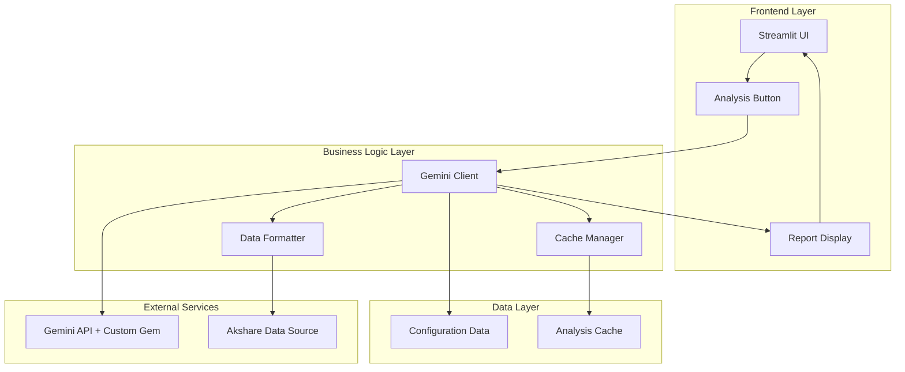

# Design Document

## Overview

AI股票分析功能将作为现有A股历史行情导出工具的核心扩展，使用Google Gemini API和已调教好的Gem进行威科夫技术分析。该功能采用简洁的模块化设计，直接集成到现有的Streamlit Web应用中，为用户提供一键式的专业股票分析服务。

设计目标：
- 无缝集成到现有Streamlit应用
- 使用Gemini API和自定义Gem
- 高性能和用户友好的体验
- 简单可靠的架构

## Architecture

### 系统架构图



### 核心设计原则

1. **简单优先**: 最小化组件数量，专注核心功能
2. **利用现有**: 复用akshare数据和Streamlit界面
3. **Gem优先**: 充分利用已调教好的Gemini Gem
4. **快速迭代**: 先实现MVP，后续优化

## Components and Interfaces

### 1. Gemini Client (核心客户端)

```python
class GeminiStockAnalyzer:
    """Gemini API客户端，用于股票分析"""
    
    def __init__(self, api_key: str, gem_config: Optional[dict] = None):
        """初始化Gemini客户端"""
        self.api_key = api_key
        self.model = self._init_model(gem_config)
        self.data_formatter = DataFormatter()
        self.cache_manager = CacheManager()
    
    def analyze_stock(self, symbol: str, name: str, df: pd.DataFrame, sector: str = "") -> str:
        """主要分析入口点"""
        pass
    
    def _init_model(self, gem_config: Optional[dict]) -> genai.GenerativeModel:
        """初始化Gemini模型（包含自定义Gem配置）"""
        pass
```

### 2. Data Formatter (数据格式化器)

```python
class DataFormatter:
    """格式化股票数据为AI分析所需格式"""
    
    def prepare_data_summary(self, df: pd.DataFrame, symbol: str, name: str, sector: str) -> dict:
        """准备数据摘要"""
        pass
    
    def build_analysis_prompt(self, data_summary: dict) -> str:
        """构建分析提示词"""
        pass
    
    def format_recent_data(self, recent_data: list) -> str:
        """格式化最近数据为表格"""
        pass
```

### 3. Cache Manager (缓存管理器)

```python
class CacheManager:
    """管理分析结果缓存"""
    
    def __init__(self, ttl_hours: int = 24):
        """初始化缓存管理器"""
        self.ttl_hours = ttl_hours
        self.cache = {}
    
    def get_cached_result(self, cache_key: str) -> Optional[str]:
        """获取缓存的分析结果"""
        pass
    
    def set_cached_result(self, cache_key: str, result: str):
        """存储分析结果到缓存"""
        pass
    
    def generate_cache_key(self, symbol: str, date: str) -> str:
        """生成缓存键"""
        pass
```

## Data Models

### 核心数据结构

```python
@dataclass
class GeminiConfig:
    """Gemini API配置"""
    api_key: str
    model_name: str = "gemini-pro"
    gem_instructions: Optional[str] = None  # 自定义Gem的提示词
    temperature: float = 0.7
    max_tokens: int = 2048

@dataclass
class DataSummary:
    """股票数据摘要"""
    symbol: str
    name: str
    sector: str
    total_days: int
    date_range: str
    current_price: float
    price_change_30d: float
    highest_30d: float
    lowest_30d: float
    avg_volume_30d: float
    volume_trend: str
    avg_turnover_30d: float
    avg_amplitude_30d: float
    recent_data: List[dict]

@dataclass
class AnalysisResult:
    """分析结果"""
    symbol: str
    analysis_text: str  # Gemini返回的完整分析文本
    timestamp: datetime
    cached: bool = False
    cache_expires_at: Optional[datetime] = None

@dataclass
class CacheEntry:
    """缓存条目"""
    key: str
    result: str
    created_at: datetime
    expires_at: datetime
```

## Correctness Properties

*A property is a characteristic or behavior that should hold true across all valid executions of a system-essentially, a formal statement about what the system should do.*

### 核心正确性属性

Property 1: Gemini API调用成功性
*For any* valid API key and stock data, the Gemini client should either return a valid analysis result or a well-defined error state
**Validates: Requirements 3.1, 4.1**

Property 2: 数据格式化完整性
*For any* stock DataFrame with required columns, the data formatter should produce a complete data summary with all required fields
**Validates: Requirements 2.1, 2.2**

Property 3: 缓存一致性
*For any* stock symbol and date, repeated analysis requests within the cache TTL period should return identical results
**Validates: Requirements 5.1, 5.2**

Property 4: 配置验证
*For any* system startup, the config manager should either load valid configuration or fail with a clear error message
**Validates: Requirements 7.1, 7.2**

Property 5: UI响应性
*For any* analysis request, the user interface should display progress feedback and handle both success and failure states
**Validates: Requirements 6.2, 6.4**

## Error Handling

### Error Classification

1. **API Errors**: Gemini API调用失败或超时
2. **Configuration Errors**: API密钥缺失或无效
3. **Data Errors**: 股票数据格式不正确
4. **Cache Errors**: 缓存读写失败

### Error Handling Strategy

```python
class AnalysisError(Exception):
    """分析过程中的基础异常类"""
    def __init__(self, message: str, error_code: str, recoverable: bool = True):
        self.message = message
        self.error_code = error_code
        self.recoverable = recoverable
        super().__init__(message)

class GeminiAPIError(AnalysisError):
    """Gemini API调用错误"""
    pass

class ConfigurationError(AnalysisError):
    """配置错误"""
    pass
```

### 错误恢复机制

1. **重试机制**: API调用失败时自动重试（最多3次，指数退避）
2. **友好提示**: 所有错误都转换为用户可理解的提示信息
3. **缓存回退**: 新分析失败时尝试返回缓存的历史结果
4. **日志记录**: 记录所有错误以便调试

## Testing Strategy

### 测试方法

本系统采用简化的测试策略：

- **单元测试**: 验证核心功能和边界情况
- **集成测试**: 验证Gemini API调用和端到端流程
- **手动测试**: 验证UI交互和用户体验

### 单元测试重点

- 数据格式化的正确性
- 缓存存取的准确性
- 错误处理的完整性
- 配置加载的可靠性

### 集成测试场景

1. **完整分析流程**: 从数据输入到报告展示的端到端测试
2. **Gemini API集成**: 与真实Gemini API的集成测试
3. **缓存系统**: 缓存存储和检索的完整性测试
4. **错误恢复**: 各种故障场景下的系统恢复能力测试

### 性能目标

- **响应时间**: 单次分析应在30秒内完成
- **缓存命中率**: 应达到60%以上
- **错误率**: API调用成功率应达到95%以上